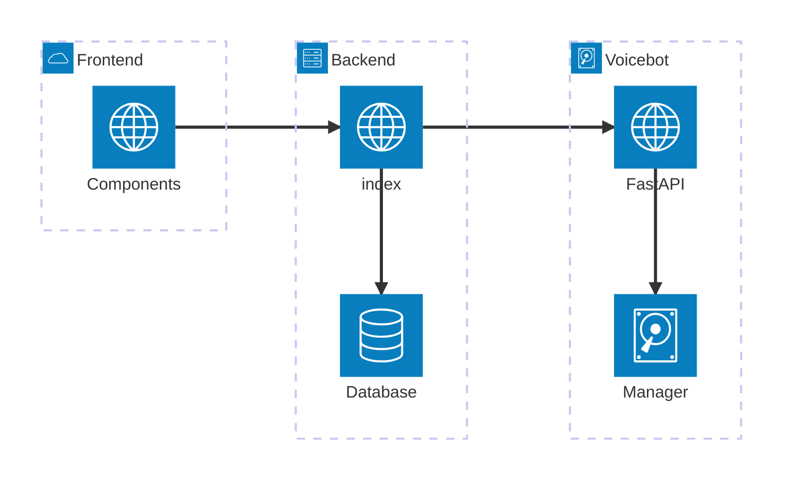

# customer-driven-project

Table of contents:
 - Background
 - How to run the project
 - Structure & internal documentation

# Background

This project is a system capable of automatically authenticate a bank customer calling customer support. This is done using an AI 'voicebot' to ask questions, and process the answer. It also includes a lightweight banking system to test the voicebot implementation, along with a client to show the results. The goal is to (i) reduce queue time for callers of customer support, (ii) reduce human operator time spent per call, and (iii) retain high customer satisfaction.  

Due to an NDA we have signed, some parts of the product had to be removed. This is done in collaboration with our supervisor and customer. This specifically includes the authorization questions, how the confidence score is calculated, and how we use Ollama to refine a caller response into a usable query. Removing these parts unfortunately makes the product crash when run, but the code still showcases most of our logic.

## Roles
 
**Team leader:**  Sondre Pedersen     
**Quality manager:** Kristian Gautefall Carlenius    
**Scrum master:** Hanna Lunne   
**Report manager:** Magnus Brekke Nilsen  
**UX manager:** Emil Ekholdt  
**Product owner:** Nora Mo  
**Docker manager:** Emiel Michiel Herman Eij

# Running the projects

### Prerequisites

- Node v20.5+ and npm v9.8+.
- python 3
- [ollama](https://ollama.com/) 

A startup script has been created.
2. Navigate to the root folder in a terminal 
3. Write `./dev-startup.sh`. 

It is also possible to run each of the three separate modules independently. To do this, follow instructions the readme for frontend/, backend/ and whisper/. Note that functionality will be limited if only part of the system is running. 

# Structure & internal documentation

```code
.
├── architecture
│   ├── logical
│   │   ├── componentDiagram.png
│   │   └── componentDiagramUML.txt
│   ├── physical
│   │   ├── deploymentDiagram.png
│   │   └── deploymentDiagramUML.txt
│   └── process
│       ├── activityDiagram.png
│       ├── activityDiagramUML.txt
│       ├── process-state-machine.drawio.png
│       ├── sequenceDiagram.png
│       └── sequenceDiagramUML.txt
├── backend
│   ├── README.md
│   └── src
│       ├── database
│       ├── endpoints
│       └── index.ts
├── dev-startup.sh
├── frontend
│   ├── README.md
│   ├── src
│   │   ├── App.tsx
│   │   ├── assets
│   │   ├── components
│   │   ├── hooks
│   │   ├── index.css
│   │   ├── main.tsx
│   │   ├── pages
│   │   ├── types
│   │   ├── utils
├── LICENSE
├── README.md
└── whisper
    ├── api.py
    ├── assets
    │   ├── ...audio recordings...
    ├── interfaces
    │   ├── Asker.py
    │   ├── Confidence.py
    │   ├── Generator.py
    │   ├── Identifier.py
    │   └── Refiner.py
    ├── Manager.py
    ├── PipelineFactory.py
    ├── README.md
    ├── RealTime_STT.py
    ├── requirements.txt
    ├── strategies
    │   ├── AnswerRefiner.py
    │   ├── AudioModels.py
    │   ├── classes.py
    │   ├── ConfidenceCalculator.py
    │   ├── CustomerIdentifier.py
    │   ├── QuestionAskerCommandLine.py
    │   ├── QuestionAsker.py
    │   ├── QuestionAskerText.py
    │   ├── QuestionGenerator.py
    │   └── ResourceRequester.py
    └── unittest.py
```

The core product can be found in whisper/. The most important file here is Manager.py, which is the point of entry for the application. api.py handles external communication with the program.
The manager uses implementations from the whisper/interfaces/ folder. These implementations can be found in whisper/strategies.

## Keypoints

- Async functions from frontend to backend are written in the specific component using them. More details in `fronted/README.md`. 
- All backend communcation is written in `backend/src/index.ts`.
- Voicebot communication is written in `whisper/api.py`

This diagram shows communication between the three modules. 



Arrows point in the direction of usage. Frontend components use functions from async, but not the other way around. Dotted lines indicate which part of the system are "on the same machine". Any communication crossing a dotted line must therefore be done with a http(s) request. 

Communication is in general initiated from left to right. This means that the frontend will send a request to the backend, and wait for a response back. The backend will similarly send a request to the voicebot, and wait for some response.

For instructions on how to create the communication, see `frontend/README.md`
